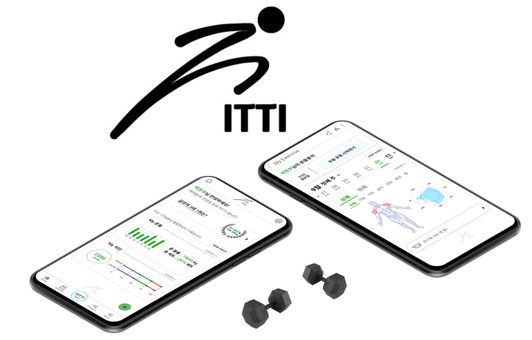
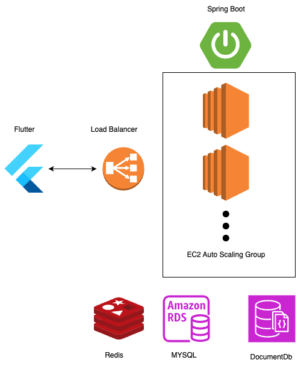
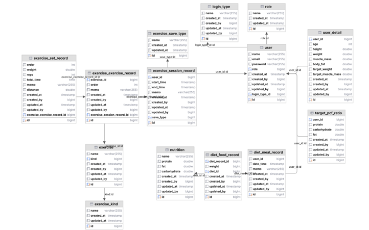

# Fitti-Backend
--------------------------

## How to start?

아래 링크를 참조하세요.\
https://fitti.atlassian.net/l/cp/YD5okCwd

## Description

헬스 운동 종목 루틴과 식단 관리 기능을 제공하는 피트니스 어플리케이션의 백엔드 파트입니다.
주요 기능은 다음과 같습니다.

- 회원가입 및 로그인 (JWT & OAUTH2)
- 운동 종목 추가 및 수정
- 루틴 생성 및 수정
- 식단 메뉴 추가 및 수정
- 식단 계획 생성 및 수정
- 친구 추가 및 친구의 루틴 및 식단 조회 그리고 커멘트
- 피트니스 커뮤니티 게시판

## Tech Architecture

다음은 백엔드의 기술 아키텍처입니다.AWS의 EC2 인스턴스에 Github Actions를 이용하여 CI/CD를 구축하였습니다.

## ERD

다음은 백엔드의 ERD입니다.
유저 정보 테이블과 운동 관련 테이블, 식단 관련 테이블로 구성되어 있습니다.

